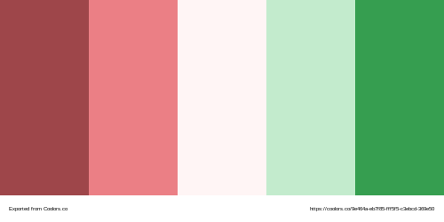

# My About Me 
## Hello my name is ***Gavin Corley*** and this is my About Me website:

I have learned a lot while working on this project and while it hasn't always been easy, it was a very fun and helpful journey. It was a bumpy ride to get to where the site is now, working relentlessly to achieve an ideal mix of look and functionality. I ran into my fair share of bugs and misspells that tried to derail my project. you would think that forgetting something as small as a period wouldn't be a big problem, but boy was I wrong. It was very helpful to encounter these problems because it helped me learn how to troubleshoot my own problems as the professor will not always be there to guide me. I learned lots of useful techniques while building my website such as how to link CSS into an HTML document, use hover effects, and even how to embed a YouTube video. Even before I learned how to do all of that I had to learn the basics of HTML such as how to use main or header these simple tags are what help put together the foundation of my website. Building a website is an intricate and lengthy process but the end result is worth all the countless hours and confused looks.
# My Color Scheme:

I chose this color scheme because I thought that the colors were very pleasant to look at and easy on the eyes.

## Colors:
- **English Red** #9E464A
- **Light Coral** #EB7F85
- **Snow** #FFF5F5
- **Aero Blue** #C3EBCD
- **Green Pigment** #369E50
# Citations:
- Fonts (https://fonts.googleapis.com/css2?family=Bebas+Neue&display=swap)(https://fonts.googleapis.com/css2?family=Abel&display=swap)
- HTML inqeuries (https://www.w3schools.com/tags/default.asp)
- Color Palette (https://coolors.co/9e464a-eb7f85-fff5f5-c3ebcd-369e50)(https://color.adobe.com/create/color-wheel)
# License:
 This work is licensed under a <a rel="license" href="http://creativecommons.org/licenses/by/4.0/">Creative Commons Attribution 4.0 International License</a>.